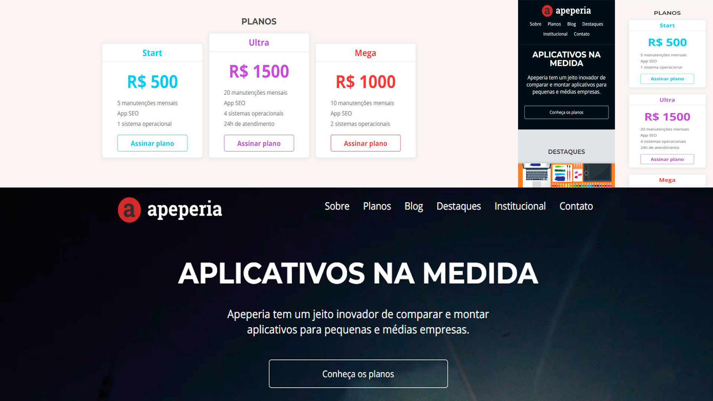

<h1 align="center"> Apeperia </h1>

  

## 🚀 Tecnologias

Esse projeto foi desenvolvido com as seguintes tecnologias:

- HTML e CSS
- Figma
- Git e Github

## 💻 Projeto

Apeperia é um site totalmente responsivo para smartphones , tablets e desktops no estilo venda de aplicativos personalizados para empresas e pessoas.
Foi criado visando praticar responsividade, estrutura CSS(Block, Element, Modifier) e acessibilidade.

- [Acesse o projeto finalizado, online](https://ramonwordads.github.io/appStore/)
